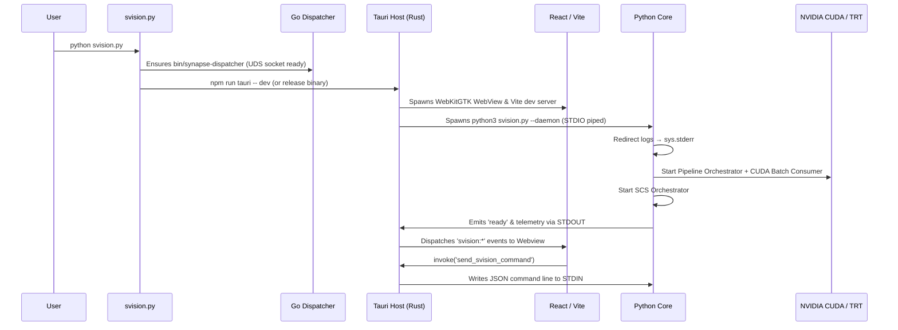

<div align="center">


# SVISION — System Blueprint & Tripartite Architecture
### Synapse Vision — Sovereign Edge AI Platform for Real-Time Urban Traffic Intelligence
*Noxfort Systems — A State Of Art Company*

</div>

⬅️ Back to [Main Documentation Hub](docs/SVISION_MOC.md) | ⚡ See [GPU Pipeline](docs/gpu-pipeline.md) | 🔌 See [Zero-Port IPC](docs/ipc-architecture.md) | 🌐 See [Go Dispatcher](docs/synapse-dispatcher-go.md)

---

## Overview

**SVISION** (**Synapse Vision**) is a sovereign edge AI platform engineered for real-time urban traffic analysis and autonomous signal orchestration. The architecture follows **SOLID** principles with strict separation between the native desktop interface (Tauri v2 / Rust / React 19), the cognitive engine (Python 3.12 / PyTorch / TensorRT), and the high-throughput network gatekeeper (Go 1.22+), connected through zero-latency IPC and local Unix Domain Sockets.

```
┌─────────────────────────────────────────────────────────────────────────────┐
│                                 svision.py                                  │
│                      Master Bootstrapper & Lifecycle                        │
├───────────────────────┬──────────────────────────┬──────────────────────────┤
│   Rust Desktop Host   │      Python AI Core      │  Go Synapse Dispatcher   │
│   (Tauri v2 + WebKit) │   (PyTorch + TensorRT)   │      (svision-go)        │
│  ┌─────────────────┐  │   ┌──────────────────┐   │   ┌──────────────────┐   │
│  │ React 19 UI     │  │   │ StdioDaemon      │   │   │ UDSServer        │   │
│  │ Vite + Tailwind │  │   │ CommandRouter    │   │   │ (/tmp/synapse)   │   │
│  │ ECharts Charts  │  │   │ Telemetry Loop   │   │   └────────┬─────────┘   │
│  └────────┬────────┘  │   └────────┬─────────┘   │            │             │
│           │           │            │             │   ┌────────▼─────────┐   │
│  ┌────────▼────────┐  │   ┌────────▼─────────┐   │   │ PortManager      │   │
│  │ Native Subproc  │◄═╪══►│ StdioTransport  │   │   │ TCP Multiplexer  │   │
│  │ STDIN / STDOUT  │  │   │ (Zero-Port IPC)  │   │   └────────┬─────────┘   │
│  └─────────────────┘  │   └────────┬─────────┘   │            │             │
│                       │            │             │            │             │
│                       │   ┌────────▼─────────┐   │            │             │
│                       │   │ CUDABatchConsumer│   │            │             │
│                       │   │ YOLO 11 TRT FP16 │   │            │             │
│                       │   │ Kalman Tracker   │   │            │             │
│                       │   └────────┬─────────┘   │            │             │
│                       │            │ UDS Push    │            │             │
│                       │            └─────────────┼────────────┘             │
│                       │                          │  Outbound TCP Streams    │
│                       │                          ▼  (Traffic Telemetry)     │
│                       │               ┌───────────────────────┐             │
│                       │               │ Synapse Core Cluster  │             │
│                       │               └───────────────────────┘             │
└───────────────────────┴─────────────────────────────────────────────────────┘
```

## Technology Stack

| Layer | Technologies |
|-------|-------------|
| **Desktop Shell** | Tauri v2, Rust, WebKitGTK |
| **Frontend UI** | React 19, Vite 8, Tailwind CSS v4, Apache ECharts (`echarts-for-react`), Lucide React |
| **Core AI Runtime** | Python 3.12+, PyTorch 2.2+, Ultralytics YOLO 11, TensorRT 10.x, OpenCV (Headless), Kornia |
| **Tracking & Kinematics** | NumPy, SciPy, Scikit-learn (DBSCAN), LapX, ByteTrack |
| **Hardware Telemetry** | PyNVML, Psutil, NVDEC (FFMPEG hardware acceleration) |
| **Network Gatekeeper** | Go 1.22+, Unix Domain Sockets (UDS), persistent TCP connection pooling |
| **IPC Architecture** | Standard I/O (STDIN/STDOUT) Zero-Port IPC with line-delimited JSON |
| **Persistence** | SQLite, SQLAlchemy, Aiosqlite, Pydantic Settings |
| **Security & Compliance**| Edge Sovereignty, `_sanitized_excepthook` LGPD scrubber, 0o600 socket permissions |

## Architectural Principles

1. **Edge Sovereignty** — 100% local processing on the device's GPU. No video frames or biometric pixels leave the edge appliance.
2. **Zero-Port IPC** — Parent-child communication over OS pipes (`STDIN`/`STDOUT`). Completely eliminates open network ports for the local UI.
3. **SOLID Modules** — Each class adheres to Single Responsibility (SRP) with injectable dependencies (DIP).
4. **LGPD by Design** — Active sanitization of tensors and image buffers in tracebacks and memory dumps.
5. **GPU-First Inference** — NVDEC video decoding, asynchronous CUDA batch consumer, TensorRT FP16, and GPU Point-in-Polygon tensor tests.
6. **Fire-and-Forget Egress** — Non-blocking telemetry dispatch with volatile RAM buffer (LRU) fallback during network degradation.

## Backend Modules (`src/`)

| Module | Directory | Responsibility | Documentation |
|--------|-----------|----------------|---------------|
| **IPC** | `src/ipc/` | Standard I/O daemon (Zero-Port), command router, stdio transport | [`docs/ipc-architecture.md`](docs/ipc-architecture.md) |
| **Engine** | `src/engine/` | Pipeline orchestrator, CUDA batch consumer, model gearbox, SCS | [`docs/gpu-pipeline.md`](docs/gpu-pipeline.md) |
| **Vision** | `src/vision/` | Stream decoder (NVDEC), Kalman tracker, lane mapper, ASC analyzer | [`docs/vision-subsystem.md`](docs/vision-subsystem.md) |
| **Network** | `src/network/` | Synapse builder (v2.0), micro batcher, UDS client | [`docs/data-egress.md`](docs/data-egress.md) |
| **Common** | `src/common/` | Config, state manager, SQLite database | [`docs/configuration-reference.md`](docs/configuration-reference.md) |
| **Models** | `src/models/` | YOLO weights, TensorRT engines, Wavelet AutoEncoder | [`docs/gpu-pipeline.md`](docs/gpu-pipeline.md) |

## Desktop & Network Gatekeeper

| Module | Directory | Responsibility | Documentation |
|--------|-----------|----------------|---------------|
| **Tauri v2** | `src-tauri/` | Rust Desktop Shell, subprocess lifecycle, STDIO IPC bridge | [`docs/desktop-ui-tauri.md`](docs/desktop-ui-tauri.md) |
| **Frontend** | `ui/` | React 19 UI, views (Workspace, Sensors, Engine, Network, Settings), hooks | [`docs/desktop-ui-tauri.md`](docs/desktop-ui-tauri.md) |
| **Go Dispatcher** | `svision-go/` | UDS server, dynamic TCP port manager, stream multiplexer | [`docs/synapse-dispatcher-go.md`](docs/synapse-dispatcher-go.md) |

## Central Documentation Hub

For in-depth documentation on each subsystem, see the [`docs/`](docs/index.md) folder:

- [📖 Central Documentation Hub (MOC)](docs/index.md)
- [🏗️ System Architecture Overview](docs/architecture-overview.md)
- [🔌 Zero-Port IPC Architecture](docs/ipc-architecture.md)
- [⚡ GPU Inference Pipeline](docs/gpu-pipeline.md)
- [👁️ Computer Vision Subsystem](docs/vision-subsystem.md)
- [🔄 Camera Lifecycle (SCS & Topology)](docs/camera-lifecycle.md)
- [🌐 Go Synapse Dispatcher](docs/synapse-dispatcher-go.md)
- [📤 Data Egress & Telemetry](docs/data-egress.md)
- [🖥️ Desktop UI (Tauri v2 + React 19)](docs/desktop-ui-tauri.md)
- [🔒 Security, Process Isolation & LGPD](docs/security-lgpd.md)
- [📡 API & IPC Reference](docs/api-and-ipc-reference.md)
- [⚙️ Configuration Reference](docs/configuration-reference.md)
- [🧪 Development & Testing Guide](docs/development-testing.md)
- [🛠️ Edge Deployment & Operations](docs/deployment-operations.md)

## Boot Sequence



## License

**GNU Affero General Public License v3.0 (AGPL-3.0)**  
Copyright © 2026 Gabriel Moraes — Noxfort Systems

---

<div align="center">
  <br/>
  <b>Noxfort Systems</b> — <i>A State Of Art Company</i><br/>
  <i>Sovereign Edge Vision Engineering • SVISION v1.2.0</i><br/>
  <small>© 2026 Noxfort Systems. Licensed under AGPLv3.</small>
</div>
