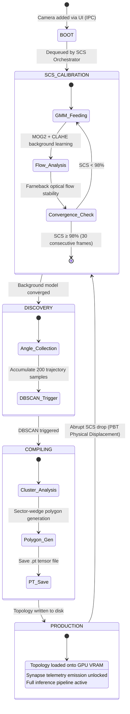

[🏠 Home](index.md) › **Camera Lifecycle**

---

# Camera Lifecycle

> SVision — Architecture Documentation  
> Copyright © 2026 Gabriel Moraes — Noxfort Systems

---

## Overview

Each camera sensor in SVision transitions through an automated 5-state onboarding pipeline. This state machine guarantees that no sensor emits operational traffic telemetry before its background model is fully converged and its lane polygon topology is compiled.



---

## Detailed States

### 1. BOOT

**Trigger**: Camera registered via Tauri v2 IPC command (`add_camera` or `set_cameras`). See [API & IPC Reference](api-and-ipc-reference.md).

**Actions**:
- Camera metadata stored in memory via `StateManager` and persisted in the SQLite database.
- `StreamDecoder` initiates RTSP connection over TCP via NVDEC ([`vision-subsystem.md`](vision-subsystem.md)).
- `synapse_uds_client` requests a dedicated TCP port allocation from the [Go Synapse Dispatcher](synapse-dispatcher-go.md).
- Camera is enqueued into the hibernation queue of the **SCS Orchestrator**.

**Duration**: Instantaneous (< 100ms).

---

### 2. SCS_CALIBRATION (Staggered Calibration Sequencer)

**Trigger**: `SCSOrchestrator` dequeues the camera while respecting the thermal power envelope (maximum 4 concurrent calibrating cameras).

**Processing**:
1. **GMM Background Subtraction**:
   - `cv2.createBackgroundSubtractorMOG2(history=500, varThreshold=16, detectShadows=True)`.
   - Prior luminance normalization via CLAHE in the LAB color space.
   - GMM score: `100.0 - (noise_ratio * 1000.0)`.
2. **Optical Flow Stability**:
   - Temporal consistency evaluation using the Farneback dense optical flow algorithm.
   - Stability score: `1.0 - (avg_magnitude / 10.0)`.
3. **Composite SCS Score**:
   ```
   SCS = (GMM_score * 0.7) + (flow_stability * 100.0 * 0.3)
   ```
4. **Convergence Criterion**:
   - SCS ≥ 98% sustained across **30 consecutive frames** (evaluated every 100ms).

**Broadcast**: The calibration score is emitted in real time via STDOUT to the desktop interface ([`desktop-ui-tauri.md`](desktop-ui-tauri.md)).

**Typical Duration**: 5 to 30 seconds (depending on weather conditions and roadway traffic volume).

---

### 3. DISCOVERY

**Trigger**: SCS convergence criterion met.

**Processing**:
1. `CameraAgent` activates GPU inference via the [CUDA Batch Consumer](gpu-pipeline.md).
2. For each tracked vehicle from `KalmanPredictiveTracker`, computes displacement vectors.
3. `LaneMapper` accumulates trajectory heading angles into an internal profile.

**Completion Criterion**: Accumulation of **200 valid trajectory samples**.

**Typical Duration**: 30 seconds to 3 minutes (dependent on traffic volume).

---

### 4. COMPILING

**Trigger**: 200 trajectory samples accumulated.

**Processing**:
1. **DBSCAN Trajectory Clustering**:
   - `eps=15` degrees, `min_samples=10`.
   - Clusters predominant traffic directions into cardinal approach clusters (`approach_n`, `approach_se`, etc.).
2. **Sector-Wedge Polygon Generation**:
   - Each directional cluster generates an approach wedge (radius of 200px, 8 vertices, aperture of ±20°).
3. **Tensor Compilation & Persistence**:
   - Builds a PyTorch tensor shaped `[N, 8, 2]` holding polygon vertices.
   - Saves binary tensor file directly to `~/Documentos/Svision/topology/<cam_id>.pt`.
4. **Safety Fallback**: If DBSCAN fails to extract distinct clusters due to severe noise, generates a default 2-edge topology (North/South).

**Duration**: < 500ms.

---

### 5. PRODUCTION

**Trigger**: Topology `.pt` file successfully generated or loaded from cache.

**Active Capabilities**:
- ✅ **GPU Point-in-Polygon**: Topology tensor resides in GPU VRAM for fast cross-product inclusion tests (Tensor Cores).
- ✅ **Synapse Telemetry Unlocked**: Telemetry dispatch is authorized to the [Go Synapse Dispatcher](synapse-dispatcher-go.md) and central cluster.
- ✅ **Real-Time Counting & Velocity**: Virtual trigger line crossing detection coupled with metric homography speed estimation.

> [!TIP]
> **Fast-Path Boot (Instant Production)**:
> If the `.pt` topology file already exists on disk when the system starts, the camera immediately enters **PRODUCTION**, executing background SCS calibration concurrently.

---

## Autonomic Self-Optimization

### Power Envelope Control (`SCSOrchestrator`)

Prevents cold-start power spikes and CPU starvation by throttling concurrent GMM/Farneback calibration jobs:

```python
class StaggeredCalibrationSequencer:
    batch_size = 4  # Maximum 4 cameras calibrating concurrently
```

### Physical Camera Displacement Detection (`PBT Optimizer`)

Traffic cameras deployed on bridges and poles can shift due to high winds or collisions. The optimizer monitors abrupt composite score drops:

$$\text{SCS}_{\text{previous}} > 90\% \quad \land \quad \text{SCS}_{\text{current}} < 50\% \implies \text{PHYSICAL DISPLACEMENT DETECTED}$$

**Emergency Response**:
1. Camera state reverts to `SCS_CALIBRATION`.
2. Stale topology is purged from GPU VRAM.
3. An emergency recalibration event is dispatched to the desktop operator dashboard.

### Phantom Track Purging (Kinematic Sanity Check)

To prevent glare or lens reflections from generating false counts, tracks showing impossible velocities (> 300 pixels/frame displacement) are instantly purged.

---

## Related Documents

- [🏠 Main Index / MOC](index.md)
- [🏗️ Architecture Overview](architecture-overview.md)
- [👁️ Computer Vision Subsystem](vision-subsystem.md)
- [⚡ GPU Inference Pipeline](gpu-pipeline.md)
- [📤 Data Egress & Telemetry](data-egress.md)
- [🌐 Go Synapse Dispatcher](synapse-dispatcher-go.md)

---

<div align="center">
  <br/>
  <b>Noxfort Systems</b> — <i>A State Of Art Company</i><br/>
  <i>Sovereign Edge Vision Engineering • SVISION v1.2.0</i><br/>
  <small>© 2026 Noxfort Systems. Licensed under AGPLv3.</small>
</div>
