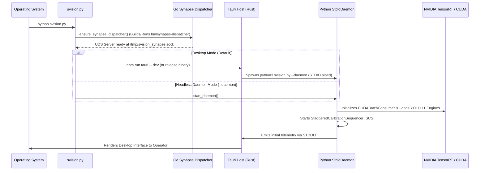

[🏠 Home](../index.md) › **Architecture Overview**

---

# SVision — System Architecture Overview

> SVision — Architecture Documentation  
> Copyright © 2026 Gabriel Moraes — Noxfort Systems

---

## 1. Executive Summary

**SVision** is a sovereign edge artificial intelligence platform (*Sovereign Edge AI*) engineered for real-time urban traffic analysis and autonomous signal orchestration.

The architecture strictly follows **SOLID**, **Edge Sovereignty**, and **Zero-Network IPC** principles, ensuring that no raw video frames traverse external networks and that all computer vision processing occurs locally on dedicated hardware accelerators (NVIDIA TensorRT / CUDA).

```
┌─────────────────────────────────────────────────────────────────────────────┐
│                                 svision.py                                  │
│                      Master Bootstrapper & Lifecycle                        │
├───────────────────────┬──────────────────────────┬──────────────────────────┤
│   Rust Desktop Host   │      Python AI Core      │  Go Synapse Dispatcher   │
│   (Tauri v2 + WebKit) │   (PyTorch + TensorRT)   │      (svision-go)        │
│  ┌─────────────────┐  │   ┌──────────────────┐   │   ┌──────────────────┐   │
│  │ React 19 UI     │  │   │ StdioDaemon      │   │   │ UDSServer        │   │
│  │ Vite + Tailwind │  │   │ CommandRouter    │   │   │ (/tmp/synapse)   │   │
│  │ ECharts Charts  │  │   │ Telemetry Loop   │   │   └────────┬─────────┘   │
│  └────────┬────────┘  │   └────────┬─────────┘   │            │             │
│           │           │            │             │   ┌────────▼─────────┐   │
│  ┌────────▼────────┐  │   ┌────────▼─────────┐   │   │ PortManager      │   │
│  │ Native Subproc  │◄═╪══►│ StdioTransport  │   │   │ TCP Multiplexer  │   │
│  │ STDIN / STDOUT  │  │   │ (Zero-Port IPC)  │   │   └────────┬─────────┘   │
│  └─────────────────┘  │   └────────┬─────────┘   │            │             │
│                       │            │             │            │             │
│                       │   ┌────────▼─────────┐   │            │             │
│                       │   │ CUDABatchConsumer│   │            │             │
│                       │   │ YOLO 11 TRT FP16 │   │            │             │
│                       │   │ Kalman Tracker   │   │            │             │
│                       │   └────────┬─────────┘   │            │             │
│                       │            │ UDS Push    │            │             │
│                       │            └─────────────┼────────────┘             │
│                       │                          │  Outbound TCP Streams    │
│                       │                          ▼  (Traffic Telemetry)     │
│                       │               ┌───────────────────────┐             │
│                       │               │ Central Synapse Core  │             │
│                       │               └───────────────────────┘             │
└───────────────────────┴─────────────────────────────────────────────────────┘
```

---

## 2. The Three Execution Layers

The platform decouples responsibilities across three specialized cooperating processes:

### Layer 1: Desktop Shell (Rust + Tauri v2 + React 19)
- **Source Location**: [`src-tauri/`](desktop_ui_tauri.md) and [`ui/`](desktop_ui_tauri.md).
- **Function**: Provides a modern, responsive, low-resource desktop control interface for traffic monitoring operators.
- **Key Advantage**: Leverages the system's native WebKitGTK runtime via Tauri v2 instead of bundling Chromium, cutting memory footprint by ~80% compared to Electron.
- **Communication**: Manages the lifecycle of the Python backend as a child process over standard OS pipes (`STDIN`/`STDOUT`), without opening local network ports ([`ipc_architecture.md`](ipc_architecture.md)).

### Layer 2: Cognitive AI Core (Python 3.12 + PyTorch + TensorRT)
- **Source Location**: [`src/`](gpu_pipeline.md).
- **Function**: Decodes incoming RTSP camera feeds via NVDEC, extracts dynamic regions of interest (*Neural Crop & Zoom*), runs batched inference with YOLO 11 on Tensor Cores, tracks vehicles using ByteTrack, and classifies lane approaches.
- **Operational Modes**: Runs synchronously with the desktop GUI or as an autonomous headless server daemon (*Headless Mode* via `--daemon`).

### Layer 3: Network Gatekeeper (Go Synapse Dispatcher)
- **Source Location**: [`svision-go/`](synapse_dispatcher_go.md).
- **Function**: Isolates the network stack and multiplexes persistent outbound TCP telemetry streams to the central Synapse cluster.
- **Automatic Compilation**: The master bootstrapper [`svision.py`](configuration_reference.md) detects the Go toolchain and automatically compiles the native binary `bin/synapse-dispatcher` when absent.
- **Interchange**: Receives telemetry payloads from Python over a Unix Domain Socket (`/tmp/svision_synapse.sock`), safeguarding the AI engine against network stalls.

---

## 3. Architectural Principles

1. **Edge Sovereignty**: Video frames are processed strictly on the local machine; zero video pixels are dispatched to cloud services.
2. **Zero-Port IPC**: In-process standard I/O pipes eliminate local network sockets, protecting against browser-based port scanning and local firewall collisions.
3. **Fire-and-Forget Egress**: Network drops retain packets in volatile LRU RAM buffers ([`data_egress.md`](data_egress.md)) with smooth drop policies, ensuring the GPU pipeline never blocks.
4. **SOLID Modularity**: Single-responsibility components (SRP) with dependency injection (DIP) facilitate automated unit testing and swappable model backends.
5. **LGPD Compliance by Design**: Automatic memory scrubbing and traceback sanitization ([`security_lgpd.md`](security_lgpd.md)) ensure sensitive visual data never leaks into logs.

---

## 4. Boot Sequence



---

## 5. System Module Directory Mapping

| Module | Directory | Description and Documentation |
|--------|-----------|-------------------------------|
| **Bootstrapper** | `svision.py` | Unified launcher handling environment resolution, Go daemon supervision, and signal hooks |
| **IPC Architecture** | `src/ipc/` | Zero-port STDIO daemon, command router, and telemetry broadcaster ([Doc](ipc_architecture.md)) |
| **GPU Pipeline** | `src/engine/` | Orchestrator, asynchronous CUDA batch consumer, model gearbox, and neural cropping ([Doc](gpu_pipeline.md)) |
| **Computer Vision** | `src/vision/` | NVDEC stream decoder, ByteTrack kinematic tracker, homography, and lane mapper ([Doc](vision_subsystem.md)) |
| **Camera Lifecycle** | `src/engine/scs*` | SCS calibration (MOG2 + CLAHE), DBSCAN clustering, and PBT optimizer ([Doc](camera_lifecycle.md)) |
| **Data Egress** | `src/network/` | Synapse Builder v2.0, 1 Hz MicroBatcher, and UDS client ([Doc](data_egress.md)) |
| **Go Dispatcher** | `svision-go/` | High-throughput UDS server and dynamic TCP multiplexer ([Doc](synapse_dispatcher_go.md)) |
| **Desktop UI** | `ui/` + `src-tauri/` | Tauri v2 native shell and React 19 dashboard ([Doc](desktop_ui_tauri.md)) |
| **Security & LGPD** | `src/api/` & `main.py` | Tensor sanitization and process-level boundary isolation ([Doc](security_lgpd.md)) |
| **Configuration** | `src/common/` | State manager, Pydantic settings hierarchy, and SQLite persistence ([Doc](configuration_reference.md)) |

---

## Related Documents

- [🏠 Main Index / MOC](../index.md)
- [🔌 Zero-Port IPC Architecture](ipc_architecture.md)
- [⚡ GPU Inference Pipeline](gpu_pipeline.md)
- [👁️ Computer Vision Subsystem](vision_subsystem.md)
- [🔄 Camera Lifecycle](camera_lifecycle.md)
- [🌐 Go Synapse Dispatcher](synapse_dispatcher_go.md)
- [🖥️ Desktop UI (Tauri v2)](desktop_ui_tauri.md)
- [🔒 Security & LGPD Compliance](security_lgpd.md)
- [⚙️ Configuration Reference](configuration_reference.md)

---

<div align="center">
  <br/>
  <b>Noxfort Systems</b> — <i>A State Of Art Company</i><br/>
  <i>Sovereign Edge Vision Engineering • SVISION v1.2.0</i><br/>
  <small>© 2026 Noxfort Systems. Licensed under AGPLv3.</small>
</div>
