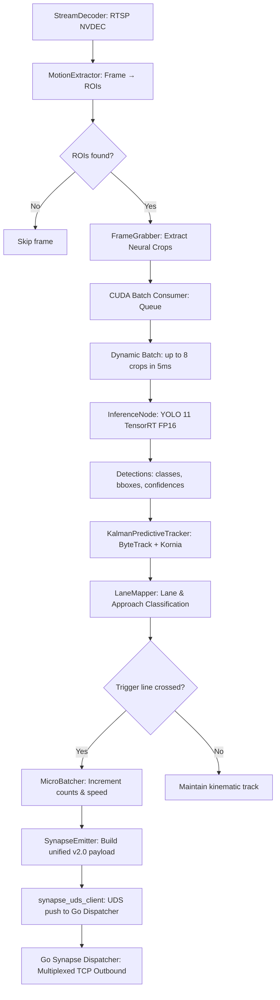

[🏠 Home](index.md) › **GPU Inference Pipeline**

---

# GPU Inference Pipeline

> SVision — Architecture Documentation  
> Copyright © 2026 Gabriel Moraes — Noxfort Systems

---

## Overview

The SVision GPU inference pipeline implements a strict **Producer-Consumer** architecture where multiple `CameraAgent` instances produce neural crops and a single **CUDA Batch Consumer** centralizes all GPU inference operations.

This pattern eliminates Python GIL contention across concurrent threads and prevents CUDA execution context collisions.

```
┌──────────────┐  ┌──────────────┐  ┌──────────────┐
│ CameraAgent  │  │ CameraAgent  │  │ CameraAgent  │
│   (cam_01)   │  │   (cam_02)   │  │   (cam_03)   │
│              │  │              │  │              │
│  FrameGrabber│  │  FrameGrabber│  │  FrameGrabber│
│  MotionExtr. │  │  MotionExtr. │  │  MotionExtr. │
└──────┬───────┘  └──────┬───────┘  └──────┬───────┘
       │                 │                 │
       │   submit_crop() │   submit_crop() │
       ▼                 ▼                 ▼
┌─────────────────────────────────────────────────┐
│            CUDA Batch Consumer                   │
│                                                  │
│  ┌────────────────────────────────────────────┐  │
│  │  asyncio.Queue (producer-consumer)         │  │
│  │  ┌─────┐ ┌─────┐ ┌─────┐ ┌─────┐         │  │
│  │  │crop1│ │crop2│ │crop3│ │crop4│ ...      │  │
│  │  └─────┘ └─────┘ └─────┘ └─────┘         │  │
│  └────────────────────────────────────────────┘  │
│                                                  │
│  Batching: max_batch=8 | timeout=5ms             │
│                                                  │
│  ┌────────────────────────────────────────────┐  │
│  │  YOLO 11 (active gear) + AMP autocast      │  │
│  │  torch.cuda.amp.autocast(enabled=True)     │  │
│  └────────────────────────────────────────────┘  │
│                                                  │
│  Results → asyncio.Future per crop               │
└──────────────────────────────────────────────────┘
```

---

## Pipeline Components

### 1. CentralPipelineOrchestrator (`src/engine/pipeline_orchestrator.py`)

Supervises the lifecycle of camera agents (`CameraAgent`).

- Monitors the camera registry in the `StateManager` via an async loop.
- Instantiates a dedicated `CameraAgent` for each discovered or IPC-added camera.
- Gracefully cancels and deallocates agents for removed cameras.
- Owns a single shared `ThreadPoolExecutor` across all agents for CPU-bound tasks.
- Spawns the `CUDABatchConsumer` during system boot.

### 2. CameraAgent (`src/engine/camera_agent.py`)

Single-responsibility per-sensor agent orchestrator:
1. Verifies that the camera has completed background calibration ([`camera-lifecycle.md`](camera-lifecycle.md)).
2. Decodes video frames via `StreamDecoder` with NVDEC hardware acceleration ([`vision-subsystem.md`](vision-subsystem.md)).
3. Extracts dynamic motion ROIs via `MotionExtractor`.
4. Submits crops to the `CUDABatchConsumer` and awaits the resulting `Future`.
5. Tracks kinematics with `KalmanPredictiveTracker` (ByteTrack).
6. Computes crossing counts at the virtual trigger line using `TriggerCounter`.
7. Adjusts inference gears dynamically via `ModelGearbox`.
8. Dispatches telemetry micro-batches via `SynapseEmitter` ([`data-egress.md`](data-egress.md)).

### 3. CUDA Batch Consumer (`src/engine/cuda_batch_consumer.py`)

Centralizes all GPU deep learning inference through an asynchronous queue (`asyncio.Queue`).

- **Dynamic Batching**: Awaits the first crop in queue, then aggregates further arrivals up to `max_batch=8` or until a `5ms` timeout expires.
- **Inference Dispatch**: Executes inference in a dedicated worker thread with `torch.cuda.amp.autocast(fp16=True)` to leverage Tensor Cores.
- **Future Resolution**: Delivers bounding boxes and confidence scores to requesting agents via individual `asyncio.Future` instances.

```python
async def _collect_batch(self) -> List[InferenceRequest]:
    batch = []
    first = await self._queue.get()   # Block until at least 1 crop
    batch.append(first)

    deadline = loop_time + 0.005      # 5ms collection window
    while len(batch) < 8:
        remaining = deadline - now
        if remaining <= 0:
            break
        req = await asyncio.wait_for(self._queue.get(), timeout=remaining)
        batch.append(req)

    return batch
```

---

## Model & Gear Management

### 4. InferenceNode & Model Gearbox (`inference_node.py` & `model_gearbox.py`)

SVision maintains multiple **YOLO 11** models co-resident in GPU VRAM, compiled into high-speed **TensorRT FP16** engines (`.engine`):

| Gear | Model | Weight Size | Target Scenario |
|------|-------|-------------|-----------------|
| **Nano** | YOLO 11n | ~6 MB | Low-density traffic, idle power and VRAM savings |
| **Small** | YOLO 11s | ~22 MB | Moderate urban traffic |
| **Medium** | YOLO 11m | ~48 MB | Heavy traffic and moderate vehicle occlusion |
| **Heavy** | YOLO 11x | ~130 MB | Peak hours, maximum precision, dense intersections |

The **Model Gearbox** is a pure state machine utilizing Exponential Moving Average (EMA) smoothing, hysteresis bands, and dwell times to prevent *gear hunting* (rapid fluctuations):

```
                 EMA Traffic Load Signal
                         │
         ┌───────────────┼───────────────┐
         │               │               │
         ▼               ▼               ▼
       ┌────┐         ┌─────┐        ┌──────┐        ┌─────┐
       │Nano│ ──12──► │Small│ ──28──►│Medium│ ──60──► │Heavy│
       │    │ ◄──7── │     │ ◄──18──│      │ ◄──40── │     │
       └────┘         └─────┘        └──────┘        └─────┘
        dwell:3s      dwell:5s       dwell:5s        dwell:8s
```

### 5. Elastic Governor & VIP Scheduler (`elastic_governor.py` & `vip_scheduler.py`)

- **Elastic Governor**: Monitors VRAM allocation and thermal headroom (`pynvml`). When memory approaches the threshold, it curtails frame rates and downshifts gears to prevent *Out of Memory (OOM)* errors.
- **VIP Scheduler**: Provides dedicated CUDA streams for prioritized camera feeds, guaranteeing that high-priority intersections suffer zero scheduling delay.
- **Triton INT8 Engine (`triton_int8_engine.py`)**: Optional INT8 engine quantization support for ultra-high density on embedded hardware (e.g., NVIDIA Jetson Orin).

---

## Neural Crop & Zoom

Instead of processing entire 1080p or 4K frames at full scale on the neural network every cycle, SVision focuses compute on active motion regions:

1. `MotionExtractor` (CPU background subtraction) identifies motion bounding boxes.
2. Object-oriented neural crops are extracted by `FrameGrabber`.
3. Crops are submitted to the `CUDABatchConsumer`.
4. Returned detection bboxes are mathematically projected back into absolute global frame coordinates.

**Key Gains**:
- **60% to 80%** reduction in GPU pixel processing area.
- Greater effective resolution on distant vehicles in the frame.
- Reduced edge appliance thermal dissipation.

---

## Full Processing Flow



---

## Related Documents

- [🏠 Main Index / MOC](index.md)
- [🏗️ Architecture Overview](architecture-overview.md)
- [👁️ Computer Vision Subsystem](vision-subsystem.md)
- [🔄 Camera Lifecycle (SCS & Topology)](camera-lifecycle.md)
- [📤 Data Egress & Telemetry](data-egress.md)
- [🌐 Go Synapse Dispatcher](synapse-dispatcher-go.md)

---

<div align="center">
  <br/>
  <b>Noxfort Systems</b> — <i>A State Of Art Company</i><br/>
  <i>Sovereign Edge Vision Engineering • SVISION v1.2.0</i><br/>
  <small>© 2026 Noxfort Systems. Licensed under AGPLv3.</small>
</div>
