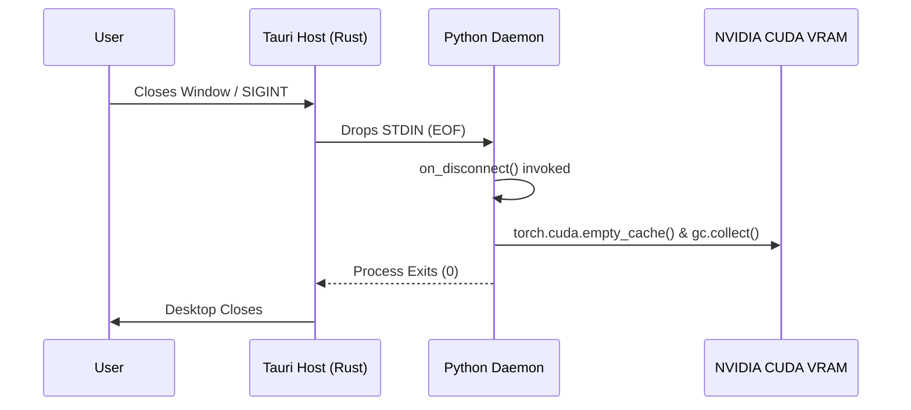

[🏠 Home](index.md) › **IPC Architecture**

---

# IPC Architecture — Standard I/O Zero-Port Architecture (Tauri v2)

> SVision — Architecture Documentation  
> Copyright © 2026 Gabriel Moraes — Noxfort Systems

---

## Overview

SVision adopts the **Standard I/O (STDIO) Zero-Port IPC Architecture** (proven in SYNAPSE CORE) to bridge the native **Tauri v2** desktop runtime (Rust + WebKitGTK) with the **Python Core**.

This architecture completely eliminates open network ports, firewall popups, local port conflicts, and ephemeral socket files in `/tmp`.

```
┌───────────────────────────────────────┐       ┌───────────────────────────────────────┐
│              Tauri v2                 │       │            Python Core                │
│            (Rust Host)                │       │          (Headless Daemon)            │
│                                       │       │                                       │
│  ┌─────────────────────────────────┐  │ STDIN │  ┌─────────────────────────────────┐  │
│  │ send_svision_command (Command)   │───►───┼──│ StdioTransport (Reader Thread)   │  │
│  │ JSON lines: {action, id, payload}│ (pipe) │  │ IpcCommandRouter                 │  │
│  └─────────────────────────────────┘  │       │  └─────────────────────────────────┘  │
│                                       │       │                                       │
│  ┌─────────────────────────────────┐  │ STDOUT│  ┌─────────────────────────────────┐  │
│  │ spawn_stdout_listener (Thread)   │───◄───┼──│ StdioTransport (write_line)       │  │
│  │ JSON lines: {type: event/resp}   │ (pipe) │  │ Telemetry Loop & Domain Emitters │  │
│  └──────────────────┬──────────────┘  │       │  └─────────────────────────────────┘  │
│                     │                 │       │                                       │
│                     ▼ emit('svision:*')       │  ┌─────────────────────────────────┐  │
│  ┌─────────────────────────────────┐  │ STDERR│  │ Logging Output                  │  │
│  │ React Frontend (WebView)        │  │ (raw) │  │ StreamHandler(sys.stderr)       │──┼──► Developer Terminal
│  │ ipcClient.subscribe / sendCommand│  │       │  └─────────────────────────────────┘  │
│  └─────────────────────────────────┘  │       │                                       │
└───────────────────────────────────────┘       └───────────────────────────────────────┘
```

---

## Key Characteristics

| Property | Value | Rationale |
|----------|-------|-----------|
| **Transport** | OS Subprocess Pipes (`STDIN` / `STDOUT`) | Zero network ports, zero firewall issues |
| **Framing** | Line-delimited JSON (`\n`) | Low overhead, human-inspectable, rock-solid |
| **Log Stream** | Inherited `STDERR` | Python logs never contaminate stdout IPC data |
| **Lifecycle** | Parent-Child Pipe Binding | When Tauri window closes, STDIN EOF cleanly halts Python |
| **Security** | In-Process OS Pipe Security | Inaccessible from LAN or external browsers |

For deeper details on process isolation and security guarantees, see [Security & LGPD Compliance](security-lgpd.md).

---

## Data Flow

### 1. Inbound Commands (React → Tauri Rust → Python STDIN)

1. A user interacts with the UI in [Desktop UI (Tauri v2 + React 19)](desktop-ui-tauri.md) (e.g., clicks "Add Camera").
2. `ipcClient.addCamera(cameraObj)` calls `invoke('send_svision_command', { action: 'add_camera', payload, id })`.
3. In Rust (`src-tauri/src/backend/ipc.rs`), `send_svision_command` writes `{"action":"add_camera","id":"...","payload":{...}}\n` into the child process's STDIN and flushes.
4. In Python (`src/ipc/stdio_transport.py`), the reader thread parses the line into `IpcMessage` and routes it through `IpcCommandRouter`.
5. The handler in [`src/ipc/command_handlers.py`](api-and-ipc-reference.md) updates `state_manager`, triggers camera stream connection, broadcasts the updated camera list, and responds with `IpcResponse`.

For the complete catalog of supported commands, see [API & IPC Reference](api-and-ipc-reference.md).

### 2. Outbound Telemetry (Python STDOUT → Tauri Rust → React Events)

1. `background_telemetry_loop()` in Python samples hardware, GPU metrics, dropped frames, network status, and camera health every second.
2. The daemon calls `self.emit_event(topic, data)` which writes `{"type":"event","event":"cameras","data":[...]}\n` to STDOUT.
3. In Rust, `spawn_stdout_listener` parses the line and emits `app_handle.emit(&format!("svision:{}", event), data)`.
4. In the WebView, `ipcClient` receives the native Tauri event and dispatches data to React hooks (`useCameras`, `useEngineStats`, `useNetworkStats`, etc.) documented in [Desktop UI (Tauri v2 + React 19)](desktop-ui-tauri.md).

---

## Graceful Shutdown Sequence

When the user closes the Tauri application:
1. Tauri triggers `tauri::RunEvent::Exit`.
2. Rust drops child STDIN and invokes `kill_backend()`.
3. Python STDIN receives EOF, triggering `on_disconnect()`.
4. Python stops all background asyncio tasks, releases GPU memory (`torch.cuda.empty_cache()`), and exits cleanly with code 0.



---

## Related Documents

- [🏠 Main Index / MOC](index.md)
- [🏗️ Architecture Overview](architecture-overview.md)
- [🖥️ Desktop UI (Tauri v2 + React 19)](desktop-ui-tauri.md)
- [📡 API & IPC Reference](api-and-ipc-reference.md)
- [🔒 Security & LGPD Compliance](security-lgpd.md)
- [🌐 Go Synapse Dispatcher](synapse-dispatcher-go.md)

---

<div align="center">
  <br/>
  <b>Noxfort Systems</b> — <i>A State Of Art Company</i><br/>
  <i>Sovereign Edge Vision Engineering • SVISION v1.2.0</i><br/>
  <small>© 2026 Noxfort Systems. Licensed under AGPLv3.</small>
</div>
