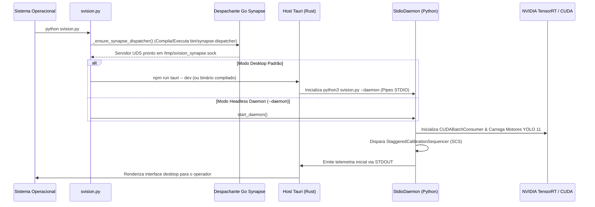

<div align="center">


# Arquitetura do Sistema e Modelo Tripartite
### Especificação da Infraestrutura de Borda Soberana (Rust + Python + Go)
*Noxfort Systems — A State Of Art Company*

</div>

⬅️ Voltar para a [Central Master MOC](svision_moc.md) | ⚡ Ver [Pipeline GPU](gpu_pipeline.md) | 🔌 Ver [Arquitetura IPC](ipc_architecture.md) | 🌐 Ver [Despachante Go](synapse_dispatcher_go.md)

---

## 1. Resumo Executivo

O **SVISION** é uma plataforma corporativa de Inteligência Artificial de Borda Soberana (*Sovereign Edge AI*) projetada para análise de tráfego urbano em tempo real e orquestração semafórica autônoma.

A arquitetura segue rigorosamente os princípios **SOLID**, **Soberania de Borda** (*Edge Sovereignty*) e **IPC de Rede Zero** (*Zero-Network IPC*), garantindo que nenhum quadro bruto de vídeo trafegue por redes externas e que todo o processamento de visão computacional ocorra localmente em aceleradores de hardware dedicados (NVIDIA TensorRT / CUDA).

```text
┌─────────────────────────────────────────────────────────────────────────────┐
│                                 svision.py                                  │
│                      Master Bootstrapper & Ciclo de Vida                    │
├───────────────────────┬──────────────────────────┬──────────────────────────┤
│   Host Desktop Rust   │    Núcleo de IA Python   │  Despachante Go Synapse  │
│   (Tauri v2 + WebKit) │   (PyTorch + TensorRT)   │      (svision-go)        │
│  ┌─────────────────┐  │   ┌──────────────────┐   │   ┌──────────────────┐   │
│  │ Interface React │  │   │ StdioDaemon      │   │   │ Servidor UDS     │   │
│  │ Vite + Tailwind │  │   │ RoteadorComandos │   │   │ (/tmp/synapse)   │   │
│  │ Gráficos ECharts│  │   │ Loop Telemetria  │   │   └────────┬─────────┘   │
│  └────────┬────────┘  │   └────────┬─────────┘   │            │             │
│           │           │            │             │   ┌────────▼─────────┐   │
│  ┌────────▼────────┐  │   ┌────────▼─────────┐   │   │ PortManager      │   │
│  │ Subprocesso SO  │◄═╪══►│ StdioTransport  │   │   │ Multiplexador TCP│   │
│  │ STDIN / STDOUT  │  │   │ (Zero-Port IPC)  │   │   └────────┬─────────┘   │
│  └─────────────────┘  │   └────────┬─────────┘   │            │             │
│                       │            │             │            │             │
│                       │   ┌────────▼─────────┐   │            │             │
│                       │   │ CUDABatchConsumer│   │            │             │
│                       │   │ YOLO 11 TRT FP16 │   │            │             │
│                       │   │ Rastreador Kalman│   │            │             │
│                       │   └────────┬─────────┘   │            │             │
│                       │            │ Push UDS    │            │             │
│                       │            └─────────────┼────────────┘             │
│                       │                          │  Fluxos TCP de Saída     │
│                       │                          ▼  (Telemetria de Tráfego) │
│                       │               ┌───────────────────────┐             │
│                       │               │ Cluster Synapse Core  │             │
│                       │               └───────────────────────┘             │
└───────────────────────┴─────────────────────────────────────────────────────┘
```

---

## 2. As Três Camadas de Execução

A plataforma desacopla suas responsabilidades em três processos cooperantes e especializados:

### Camada 1: Shell Desktop (Rust + Tauri v2 + React 19)
- **Localização no Código**: [`src-tauri/`](desktop_ui_tauri.md) e [`ui/`](desktop_ui_tauri.md).
- **Função**: Fornece uma interface de controle desktop moderna, de baixíssimo consumo de memória RAM para operadores de monitoramento e engenharia de tráfego.
- **Vantagem Competitiva**: Utiliza o runtime nativo WebKitGTK via Tauri v2 em vez de embutir instâncias pesadas do Chromium, reduzindo o consumo de memória em mais de 80% em comparação ao Electron.
- **Comunicação**: Gerencia o ciclo de vida do backend Python como subprocesso direto por meio de pipes anônimos do sistema operacional (`STDIN`/`STDOUT`), sem abrir qualquer porta de rede local ([`ipc_architecture.md`](ipc_architecture.md)).

### Camada 2: Núcleo Cognitivo de IA (Python 3.12 + PyTorch + TensorRT)
- **Localização no Código**: [`src/`](gpu_pipeline.md).
- **Função**: Decodifica fluxos RTSP diretamente via aceleração de hardware NVDEC, recorta regiões dinâmicas de interesse (*Neural Crop & Zoom*), executa inferência em lotes com YOLO 11 em Tensor Cores, rastreia veículos com ByteTrack e classifica faixas e fluxos viários.
- **Modos de Operação**: Opera de forma síncrona acoplado à interface visual ou como daemon autônomo sem interface gráfica (*Modo Headless* via `--daemon`).

### Camada 3: Gatekeeper de Rede (Despachante Go Synapse)
- **Localização no Código**: [`svision-go/`](synapse_dispatcher_go.md).
- **Função**: Isola a pilha de rede e multiplexa conexões TCP de saída de alta persistência e baixa latência até o cluster central Synapse.
- **Compilação Automática**: O inicializador mestre [`svision.py`](configuration_reference.md) detecta o compilador Go e gera automaticamente o binário nativo `bin/synapse-dispatcher` quando ausente.
- **Intercâmbio**: Recebe os pacotes de telemetria do Python através de um Unix Domain Socket (`/tmp/svision_synapse.sock`), blindando o pipeline de inferência contra qualquer travamento decorrente de instabilidade de rede.

---

## 3. Princípios Fundamentais de Engenharia

1. **Soberania de Borda**: 100% dos quadros de vídeo são processados localmente no hardware da borda; nenhum pixel é transmitido para serviços em nuvem.
2. **IPC de Porta Zero**: O tráfego interprocessos ocorre estritamente por pipes de I/O padrão, eliminando portas abertas e vulnerabilidades de varredura (*port scanning*).
3. **Egress Não Bloqueante (*Fire-and-Forget*)**: Instabilidades de rede retêm os pacotes em um buffer circular de memória RAM volátil ([`data_egress.md`](data_egress.md)) com descarte inteligente via política LRU, garantindo que o pipeline da GPU nunca sofra travamentos.
4. **Modularidade SOLID**: Princípio de responsabilidade única (SRP) e injeção de dependências (DIP) facilitam testes unitários automatizados e substituição de motores neurais.
5. **Conformidade LGPD por Design**: Higienização ativa de memória e mascaramento de rastros de erro ([`security_lgpd.md`](security_lgpd.md)) impedem que tensores ou imagens vazem em logs de exceção.

---

## 4. Sequência de Inicialização (Boot Sequence)



---

## 5. Mapeamento de Diretórios por Módulo

| Módulo | Diretório | Descrição e Documentação |
|---|---|---|
| **Inicializador** | `svision.py` | Launcher unificado, resolução de ambiente, supervisão do daemon Go e sinais de terminação |
| **Arquitetura IPC** | `src/ipc/` | Daemon STDIO de porta zero, roteador de comandos e transmissor de telemetria ([Doc](ipc_architecture.md)) |
| **Pipeline GPU** | `src/engine/` | Orquestrador, consumidor de lotes CUDA assíncrono, câmbio de modelos e corte neural ([Doc](gpu_pipeline.md)) |
| **Visão Computacional**| `src/vision/` | Decodificador NVDEC, rastreador cinemático ByteTrack, homografia e mapeador de faixas ([Doc](vision_subsystem.md)) |
| **Ciclo da Câmera** | `src/engine/scs*` | Calibração escalonada SCS (MOG2 + CLAHE), agrupamento DBSCAN e otimizador PBT ([Doc](camera_lifecycle.md)) |
| **Egress de Dados** | `src/network/` | Construtor Synapse v2.0, MicroBatcher a 1 Hz e cliente socket UDS ([Doc](data_egress.md)) |
| **Despachante Go** | `svision-go/` | Servidor UDS de alta vazão e multiplexador dinâmico de fluxos TCP ([Doc](synapse_dispatcher_go.md)) |
| **Interface Desktop** | `ui/` + `src-tauri/`| Shell nativo Tauri v2 e painel de controle em React 19 ([Doc](desktop_ui_tauri.md)) |
| **Segurança & LGPD** | `src/api/` & `main.py`| Higienização de tensores e isolamento de fronteiras de processo ([Doc](security_lgpd.md)) |
| **Configurações** | `src/common/` | Gerenciador de estado, hierarquia Pydantic e persistência SQLite ([Doc](configuration_reference.md)) |

---

<div align="center">
  <br/>
  <b>Noxfort Systems</b> — <i>A State Of Art Company</i><br/>
  <i>Engenharia de Visão de Borda Soberana • SVISION v1.2.0</i><br/>
  <small>© 2026 Noxfort Systems. Licenciado sob AGPLv3.</small>
</div>
