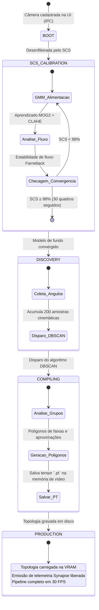

# Ciclo de Vida da Câmera & Calibração Automatizada
### Onboarding Autonômico em 5 Estágios, Sequenciador SCS e Descoberta de Faixas
*Noxfort Systems — A State Of Art Company*

⬅️ Voltar para a [Central Master MOC](svision_moc.md) | ⚡ Ver [Pipeline GPU](gpu_pipeline.md) | 👁️ Ver [Subsistema de Visão](vision_subsystem.md) | 📤 Ver [Egress de Dados](data_egress.md)

---

## 1. Visão Geral

Cada sensor de câmera no **SVISION** transita por uma máquina de estados autônoma de 5 estágios. Essa esteira rigorosa assegura que nenhum sensor transmita telemetria operacional de tráfego antes que seu modelo estocástico de fundo esteja 100% convergido e a topologia geométrica de faixas esteja compilada em tensores da GPU.

---

## 2. Os 5 Estágios do Ciclo de Vida

### Estágio 1: BOOT
- A câmera é registrada via interface ou arquivo de configuração.
- O decodificador NVDEC valida a conectividade RTSP e aloca os recursos mínimos de hardware.
- A câmera entra na fila do **SCS** (*Staggered Calibration Sequencer*).

### Estágio 2: SCS_CALIBRATION (Calibração Escalonada)
- Para evitar sobrecarga instantânea da CPU, apenas um número controlado de câmeras calibra em simultâneo.
- O algoritmo MOG2 com equalização CLAHE aprende o padrão de iluminação e estática do cenário urbano.
- A convergência é atestada após 30 quadros consecutivos com estabilidade de fluxo óptico $\ge 98\%$.

### Estágio 3: DISCOVERY (Descoberta Não Supervisionada)
- O sistema observa o movimento natural dos veículos sem intervenção manual do operador.
- 200 vetores cinemáticos de trajetórias válidas são coletados e armazenados em memória.

### Estágio 4: COMPILING (Compilação Espacial)
- O algoritmo **DBSCAN** agrupa os vetores de rumo e delimita as faixas de rolamento.
- Os vértices dos polígonos são compilados em tensores otimizados `.pt` do PyTorch.

### Estágio 5: PRODUCTION (Operação Nominal)
- A inferência em tempo real é ativada plenamente.
- O teste ponto-em-polígono vetorizado na GPU classifica veículos instantaneamente.
- Os micro-lotes de telemetria a 1 Hz são liberados para despacho ao Synapse Core.

---

   
  <b>Noxfort Systems</b> — <i>A State Of Art Company</i> 
  <i>Engenharia de Visão de Borda Soberana • SVISION v1.2.0</i> 
  <small>© 2026 Noxfort Systems. Licenciado sob AGPLv3.</small>

