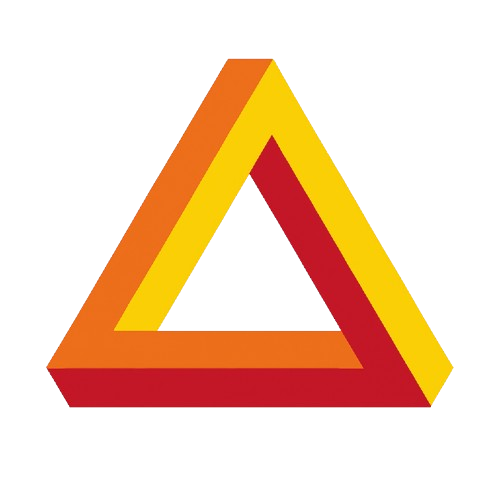

<div align="center">


# Segurança, Isolamento de Processos e Conformidade LGPD
### Soberania de Borda, Zero Egress de Imagens e Sanitização Ativa de Memória
*Noxfort Systems — A State Of Art Company*

</div>

⬅️ Voltar para a [Central Master MOC](svision_moc.md) | 🏛️ Ver [Arquitetura](architecture_overview.md) | 🔌 Ver [Arquitetura IPC](ipc_architecture.md) | 📡 Ver [Referência de API](api_and_ipc_reference.md)

---

## 1. Visão Geral

O **SVISION** foi concebido sob o princípio de **Privacidade e Segurança por Design** (*Privacy & Security by Design*), em conformidade estrita com a **Lei Geral de Proteção de Dados (LGPD - Lei nº 13.709/2018)** e padrões internacionais de governança de dados visuais de borda.

A plataforma opera sob **Soberania Absoluta de Borda** (*Edge Sovereignty*): nenhum fluxo bruto de vídeo, dados biométricos de pedestres ou caracteres legíveis de placas veiculares são transmitidos para nuvens externas ou persistidos em mídias não gerenciadas.

---

## 2. Princípios Centrais de Segurança

| Princípio | Implementação no SVISION |
|---|---|
| **Soberania de Borda** | 100% do pipeline de visão (NVDEC, YOLO, ByteTrack, LaneMapper) roda na GPU local do hardware de borda. |
| **Zero Frame Egress** | Apenas dados agregados e métricas estatísticas (fluxo veicular, velocidade média em km/h, densidade de tráfego) saem do dispositivo. |
| **Arquitetura IPC Zero-Port** | A comunicação entre UI desktop e motor de IA ocorre via pipes anônimos do sistema operacional (`STDIN`/`STDOUT`), abrindo zero portas de rede locais. |
| **Sanitização Ativa de Memória** | Redação e expurgo automático de tensores de imagem e buffers NumPy em rastros de exceção (*tracebacks*) e arquivos de log. |
| **Isolamento de Sockets** | O Unix Domain Socket do despachante Go é protegido por permissões restritas POSIX `0o600` (leitura e escrita apenas pelo usuário do processo). |

---

## 3. Sanitização de Tracebacks para Conformidade LGPD

### O Desafio
Em sistemas tradicionais de visão computacional em Python, quando ocorre uma exceção não tratada, o interpretador serializa as variáveis locais do escopo de erro. Se matrizes de imagem de câmeras de vias públicas estiverem em memória, ferramentas de log podem gravar acidentalmente pixels de cidadãos em disco.

### A Solução do SVISION
O SVISION instala um manipulador global de exceções (`_sanitized_excepthook`) em `src/main.py` que inspeciona a pilha de execução, detecta variáveis contendo tensores visuais ou arrays NumPy e os substitui por descritores anônimos antes de qualquer gravação em log:

```python
def _sanitized_excepthook(exc_type, exc_value, exc_tb):
    """Manipulador global de exceções garantindo conformidade LGPD."""
    # Percorre a pilha, detecta tensores e buffers de imagem e mascara o conteúdo
    ...
```

---

<div align="center">
  <br/>
  <b>Noxfort Systems</b> — <i>A State Of Art Company</i><br/>
  <i>Engenharia de Visão de Borda Soberana • SVISION v1.2.0</i><br/>
  <small>© 2026 Noxfort Systems. Licenciado sob AGPLv3.</small>
</div>
